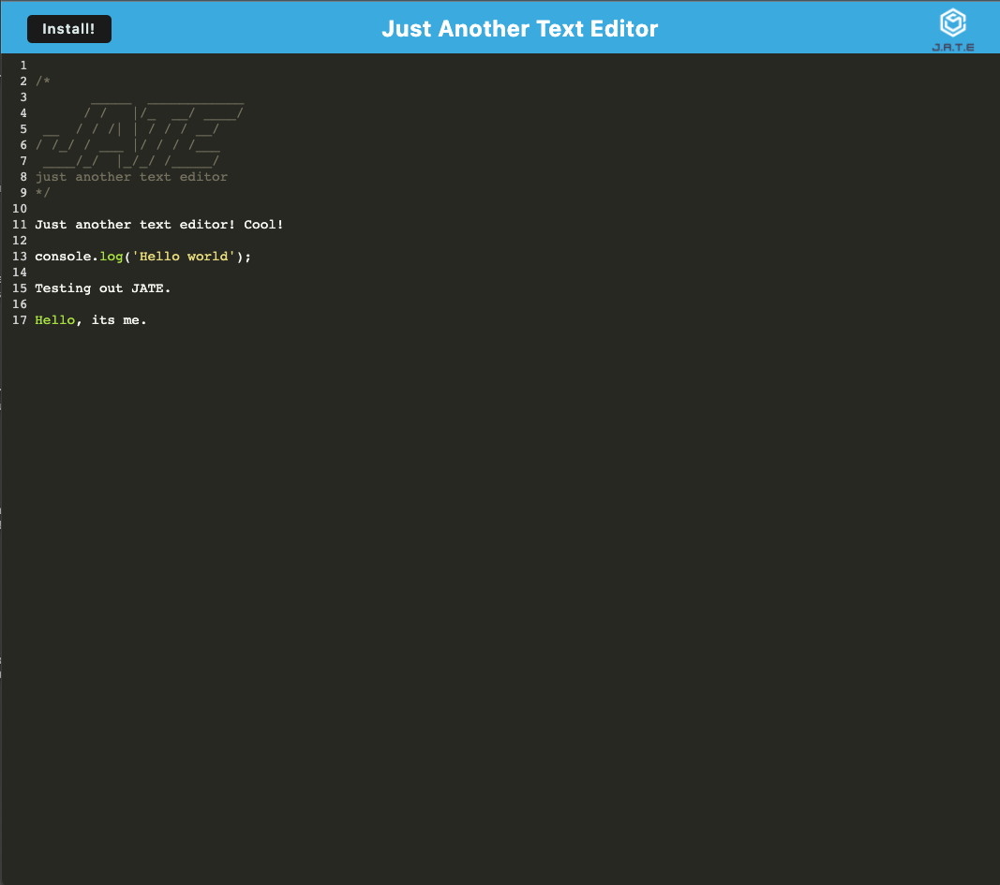
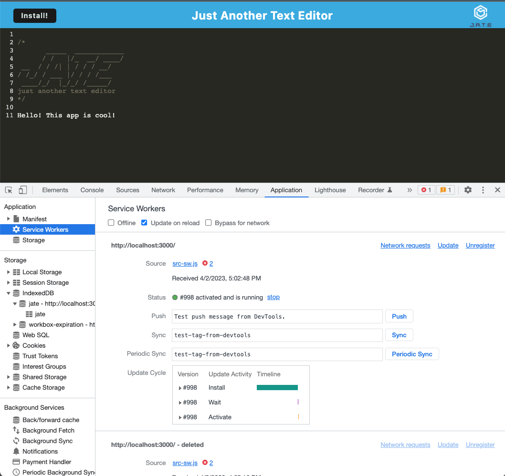
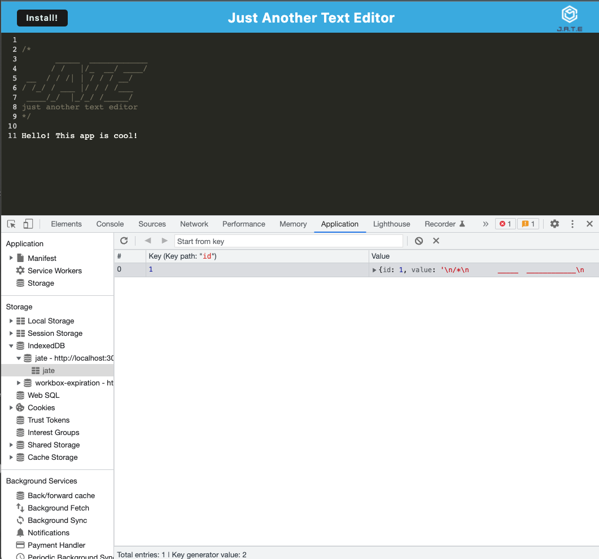
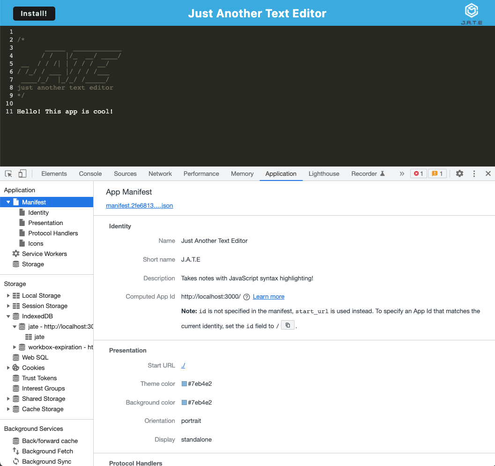

# PWA-Text-Editor

  ## Table of Contents
  - [Project description](#description)
  - [Installation](#installation)
  - [Useage](#useage)
  - [Testing](#testing)
  - [Collaborators](#collaborators)
  - [Assets](#assets)
  - [GitHub](#github)
  - [License](#license)

  ## Description 
  This application is a web text editor that runs in the browser. This is a single-page application that meets the PWA criteria. Additionally, it will feature a number of data persistence techniques that serve as redundancy in case one of the options is not supported by the browser. This application can also function offline.

  ## Installation
  This application requires the user to clone the repository and then run the command `npm install`. This will install the following npm packages:
  
  - [Express](https://www.npmjs.com/package/express)
  - [Webpack](https://www.npmjs.com/package/webpack)
  - [Webpack Dev Server](https://www.npmjs.com/package/webpack-dev-server)
  - [Webpack Pwa Manifest](https://www.npmjs.com/package/webpack-pwa-manifest)
  - [Babel](https://www.npmjs.com/package/Babel)
  - [CSS Loader](https://www.npmjs.com/package/css-loader)
  - [Concurrently](https://www.npmjs.com/package/concurrently)
  - [IndexedDB](https://www.npmjs.com/package/indexeddb)
  
  ## Useage 
  Run `npm run start` from the root directory to start up the backend and serve the client.

  To use JATE click [here](https://glacial-badlands-51639.herokuapp.com/) to open the application in the browser. To use JATE application offline, you can go to the link and click "install" to download to your applications. 

  The following image shows the application from the browser:  
  

  The following image shows the application installed on the desktop:  
  
  ## Testing 
  n/a
  
  ## Collaborators 
  n/a
  
  ## Assets 
  The following image shows the application's registered service worker:

  

  The following image shows the application's IndexedDB storage:

  

The following image shows the application's `manifest.json` file:

  

  ## Questions?
  Contact me at:

  GitHub: https://github.com/Rachelwildberger

  Email: rachel@gmail.com
  
  ## License 
  PWA Text Editor is licensed under the: 
  
  
